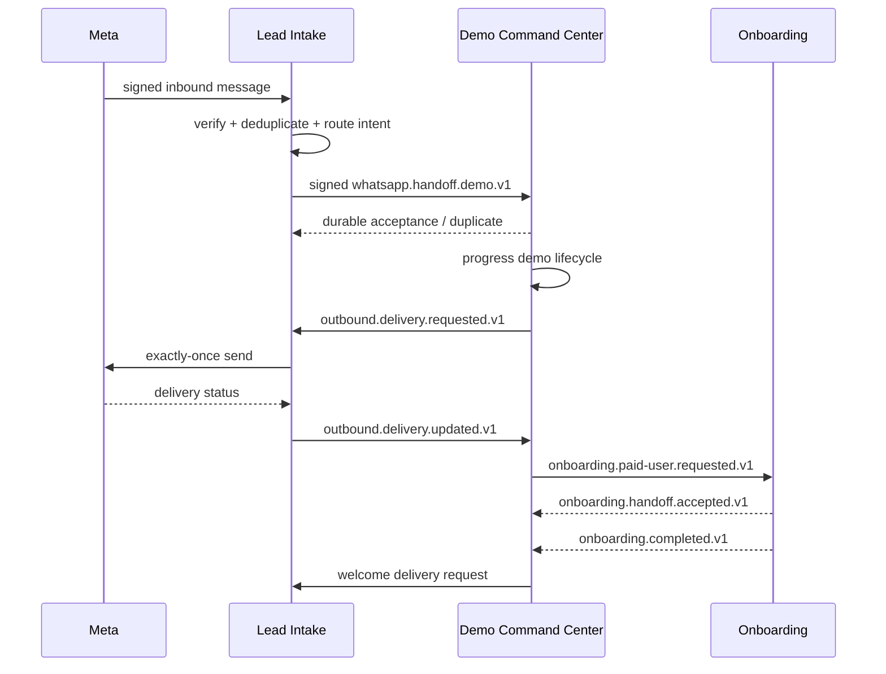

# Agent harmony

Lead Intake owns the shared public Meta webhook and the single outbound WhatsApp send decision. Demo Command Center owns demo lifecycle after a `demo.requested.v1`/`whatsapp.handoff.demo.v1` acknowledgement. Onboarding owns signup after an accepted paid handoff.

Every event uses the canonical envelope, an operation-stable idempotency key, correlation/causation IDs, and minimized payload. A receiver acknowledges only after durable inbox insertion. Synchronous reply text in legacy handoffs is a migration adapter, not the durable target contract.

If Lead Intake is unavailable, outbound requests stay queued; Demo Command Center never calls Meta as a fallback. If Onboarding is unavailable, `PAID` remains durable, an outbox retry is scheduled, and a ticket opens when the retry budget expires.
