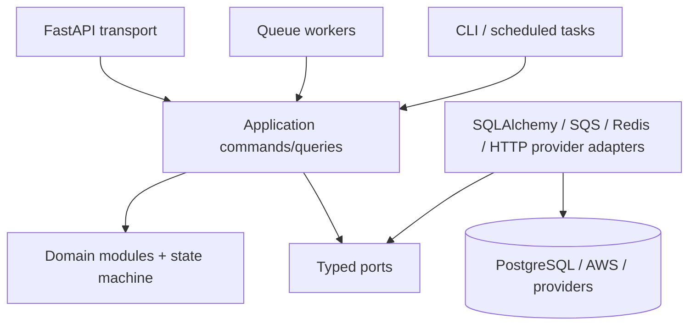

# Container and component model

One image supports distinct ECS process types:

| Process | Responsibility | Scaling signal |
|---|---|---|
| API | Internal handoffs, provider webhook boundaries, admin queries, health | ALB request/latency and CPU |
| Worker | Inbox processing, scheduling, outbound, payment, analytics | SQS oldest-message age/depth |
| Evaluation worker | Training/evaluation/drift batch | Dedicated queue/schedule |
| Scheduled task | EventBridge one-shot reminders and maintenance commands | Invoked on demand |
| Admin task | Alembic, doctor, reconciliation, DLQ redrive, retention | Manually approved ECS task |

The API does not call providers directly. Commands write state plus outbox in one database transaction. Dispatchers claim outbox rows with bounded leases and publish idempotently.
