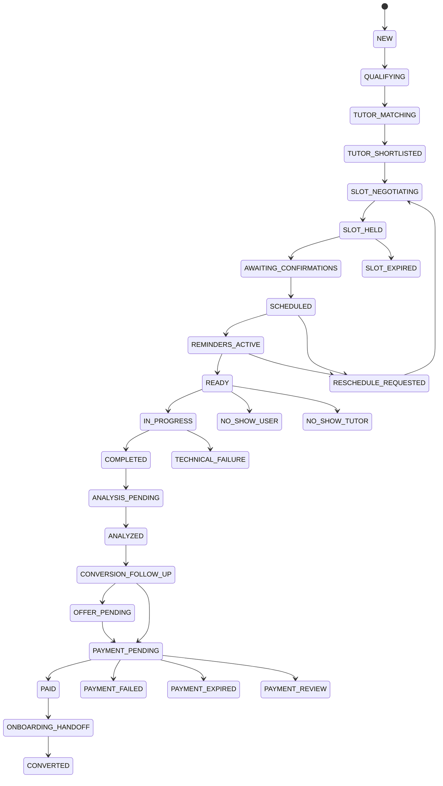

# Demo state machine

`src/demo_command_center/state/transitions/table.py` is the executable registry. Each transition declares command, allowed actors, guards, side effects, and compensation. Each accepted transition is stored with before/after state, reason, UTC time, correlation, idempotency key, flow/policy/model version, requested/completed effects, failure, and compensation.

Cancellation, human handoff, and terminal failure transitions are registered from eligible states. Orthogonal confirmation, hold, attendee, delivery, calendar, and payment status stay in dedicated records rather than multiplying lifecycle states. Optimistic `version` checks and transition idempotency prevent conflicting updates.
