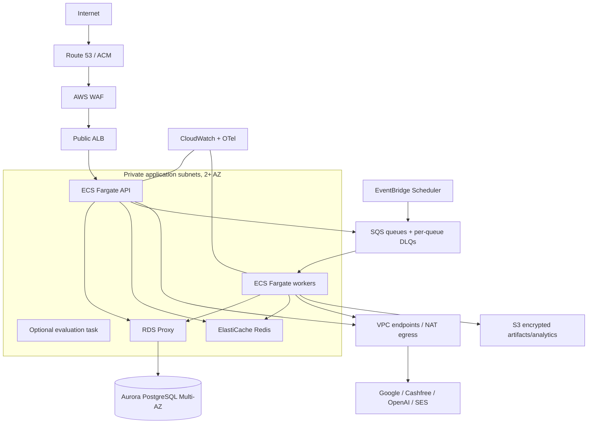

# Deployment topology

Database/cache have no public route. Tasks use least-privilege roles and Secrets Manager/KMS. Dev, staging, and prod have separate state, networks/data, secrets, queues, and GitHub Environment approvals. Images are built once, identified by digest, scanned, promoted, and rolled back without rebuilding.

An optional API-only Lambda entrypoint exists for AWS environments that prefer API Gateway v2 or a
Lambda Function URL for the HTTP surface. The lifecycle worker, outbox publisher, scheduled jobs,
migrations, reconciliation, and evaluation tasks remain ECS/SQS process types under the accepted
runtime ADR unless a future ADR explicitly changes them.
