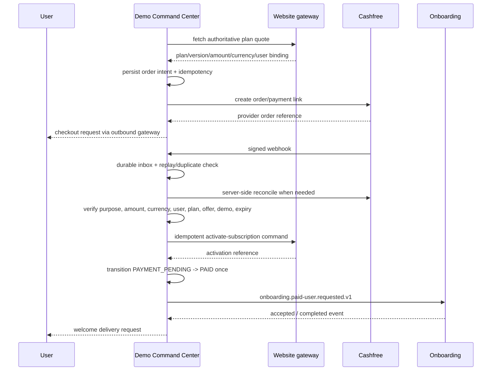

# Payment and paid-transition saga

The Demo Command Center owns orders created for demo conversion. The website continues to own unrelated subscription checkout flows. `order_purpose=demo_conversion` selects the owner and callback path.

Browser returns and WhatsApp claims are never payment evidence. The canonical transition requires valid raw-body signature, timestamp/replay checks, durable provider event uniqueness, bound order fields, and either a verified successful event or authenticated provider reconciliation. A unique activation key spans provider order and website subscription activation.

Amount/status mismatch, unknown order, duplicate account ambiguity, refund, dispute, or activation disagreement enters `PAYMENT_REVIEW` and opens a redacted human ticket. Refund/dispute processing is not automated until finance policy and website reversal contracts are approved.
