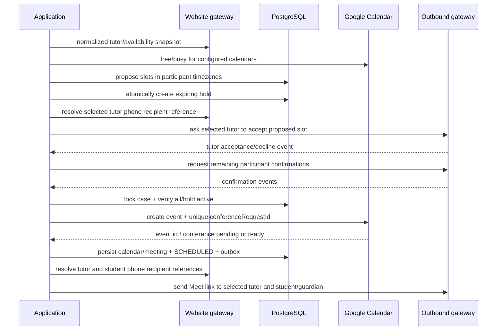
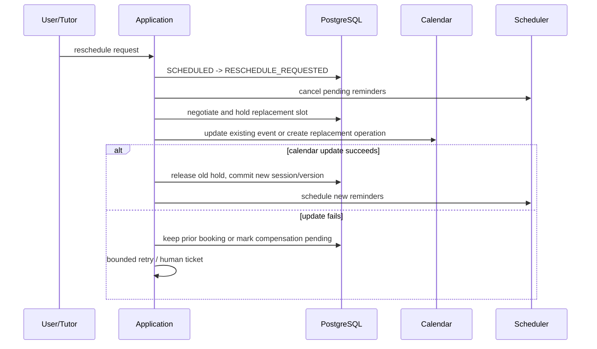

# Scheduling and rescheduling saga

## Initial scheduling

Use UTC `timestamptz` plus original IANA zones. Working hours, exceptions, buffers, mode/location feasibility, website availability, and Calendar free/busy are separate evidence with capture timestamps. Unknown availability cannot be treated as free.

An active hold is protected by a PostgreSQL range exclusion constraint per tutor/resource (planned in scheduling migration) and a unique active operation key. Redis may reduce contention but cannot establish the booking. Hold TTL/confirmation deadlines are policy values. Calendar creation uses a stable operation record, external extended property `demo_id`, and deterministic unique conference request ID; retries first reconcile before creating. The selected teacher must accept before the Google Meet operation is attempted, and link delivery is skipped while conference creation is still pending.

## Rescheduling

Never release a still-valid old booking before the replacement is durably secured unless policy explicitly accepts the gap. Notification failure does not cancel a valid calendar event; it queues retry and escalates after budget exhaustion. Calendar creation failure releases the provisional hold and returns to negotiation.
