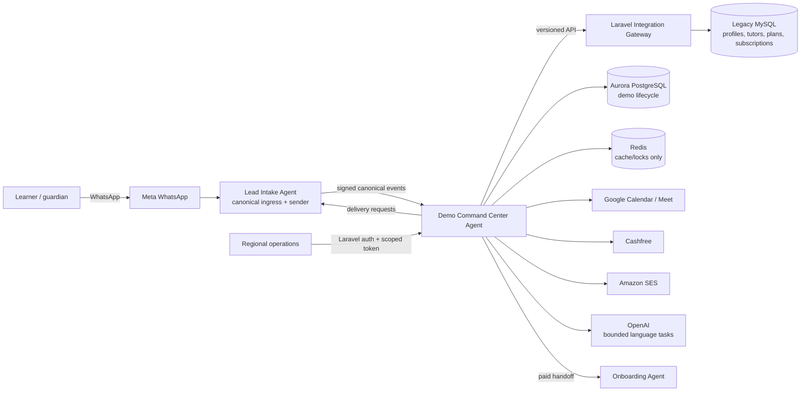

# System context

Trust boundaries exist at every arrow. Provider callbacks enter only signature-specific endpoints; internal calls use audience-bound authentication and replay protection. PostgreSQL is authoritative for lifecycle state; Redis never decides durable truth.
