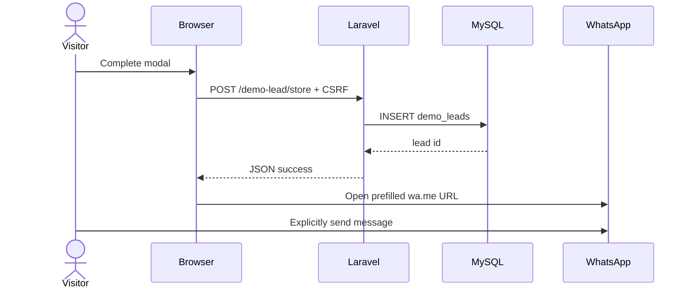

# Website demo flow

## Verified current behavior

1. Pages open `demoModal` from multiple calls to action.
2. The modal collects name, phone, service, board(s), class(es), subject(s), preferred time, mode, message, and a page-derived location.
3. Footer JavaScript posts JSON with CSRF to `POST /demo-lead/store`, protected by the `public-form` limiter.
4. `DemoLeadController::store` validates and inserts `demo_leads`, then returns the numeric lead ID.
5. Browser JavaScript constructs a prefilled message and opens `https://wa.me/<configured-number>`. The user must send the message themselves.

## Compatibility defect

The visible form uses `boards`, `classes`, and `subjects`, but footer serialization/controller validation use singular `subject` and `child_class` and do not serialize boards/classes arrays. Board/class/subject data can therefore be lost or replaced by a stale hidden field. The gateway contract must not depend on the current browser shape.

## Missing lifecycle

`demo_leads` is capture-only: it has no tenant/region, timezone, idempotency key, status/version, identity mapping, consent, assignment, scheduling, payment, or audit fields. There is no server-side handoff to Lead Intake after insert and no authoritative link between the inserted lead and the subsequent WhatsApp message.

The adapter blueprint adds a transactional outbox and versioned internal API rather than writing from Python to the table directly.
