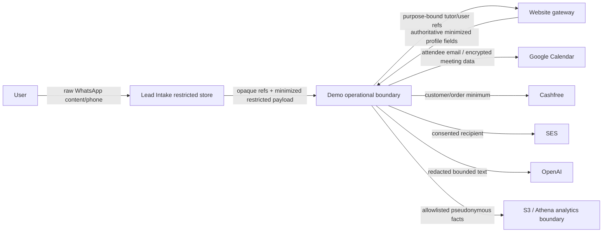

# PII data map and boundaries

Restricted: phone/email/name/address, free-form messages/feedback/evidence, guardian-child relationship/details, tutor private contact/documents, meeting links, calendar attendees, payment/customer payload, IP/user-agent, consent evidence, and provider tokens. Low/metadata: opaque IDs, coarse locale/region, delivery/provider status. Non-PII requires a documented allowlist.

Data is collected by purpose, encrypted in transit/at rest, field/envelope encrypted when highly sensitive, role/tenant/region scoped, retention tagged, and excluded from normal logs. Analytics gets only pseudonymous/coarse facts. External processors receive the minimum for the active operation and no unrelated conversation history.
